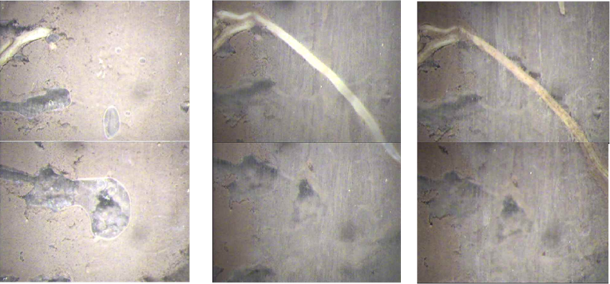

```{r setup, include=FALSE}
knitr::opts_chunk$set(echo = TRUE)
```

```{r, echo=FALSE}
library(knitr)    # For knitting document and include_graphics function
library(ggplot2)  # For plotting
# library(png)
```

## 1. Root imaging by Minirhizotron
### 1.1 Introduction to Minirhizotron system
Minirhizotron (MR) system is an non-destructive tool to study roots. MR system is made up of durable, transparent tubes installed in the ground and a light-weight cylindrical imaging device which is lowered into the tubes to collect high-resolution images and track root growth season to season.

```{r, echo=FALSE, fig.align='center', out.width="50%"}

```

### 1.2 MR image name
Each MR image is given an exclusive name by minirhizotron system (manufactured by Bartz). This name contains important information we need for later analysis. 

The dimension of each image is 13.5 mm (width) * 18.0mm (length). Each image is similar to the size of thumb nail. That’s why this system called **mini**rhizotron. 

Location number is the critical information for root study. From this we can calculate the depth roots appear, and root distribution pattern throughout the soil profile.

```{r, echo=FALSE, fig.align='center'}

```

MR system allows us to observe root dynamics since we can observe the same root repeatedly. This helps us to uncover the life story of each single root. 

```{r, echo=FALSE, fig.align='center', out.width="50%"}

```

## 2. Anotate Minirhizotron images
For root annotation , a open source software called [Rootfly](http://cecas.clemson.edu/~stb/rootfly/)
is used. This tool is specially designed for MR images. It reads the image name, then arrange images according to the order of tube, window(i.e., location), and session. Values of root length and root diameter are output. 

```{r, echo=FALSE, fig.align='center'}

```

```{r, echo=FALSE, fig.align='center'}

```

## 3. Analyze root data with R
### 3.1 Raw data 
The data exported from Rootfly is in .csv file. Keep the raw data raw is a good habit in data analysis. Therefore, we copy this file and save it as a .xlsx file (.csv file does not save figures).

Column names are given by Rootfly software. **Length date(1)** meaning root length measured at the 1st session. The most important columns include **Tube**, **Window**, **Length data**, **Diameter data**. 

```{r, echo=FALSE, fig.align='center'}

```

### 3.2 Prepare the data
